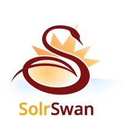

SolrSwan
========

SolrSwan is a query parser and highlighter for Solr that accepts proximity and Boolean queries. The syntax is designed to be compatible with the search syntax in use at the U.S. Patent and Trademark Office. In addition to a changed fielded query syntax, the additional operators are:

* Same
* With
* Adjacent
* Near
* XOR

Each operator takes an optional quantifier, such as "SAME3", that restricts the range over which it operates. In order to make sense of paragraphs and sentences, the searched fields need to index special tokens that identify the breaks. The test schema has an example of how to do that with solr.PatternReplaceCharFilterFactory.

The included highlighter is a modified version of the FastVectorHighlighter that is currently the default in Solr. It supports semantically accurate, multi-colored highlighting. (The Phrase highlighter in Solr supports the first, while FVH supports the second, but neither support both).

# Building
SolrSwan uses Maven dependency management and Java 7. Once those are installed, building the plugin JAR is done with:
```
mvn package
```
This will build both the plugin jar as well as a webapp that can be used to parse queries without executing them. Both packages will be in the ./target folder.

# Installation
There are a few steps needed to get Swan syntax working in Solr. First, add the new jars to solrconfig.xml like:
```xml
  <lib path="../../apache-solr-4.0/contrib/SwanParser-1.0-SNAPSHOT.jar" />
  <lib path="../../apache-solr-4.0/contrib/parboiled-core-1.0.2.jar" />
  <lib path="../../apache-solr-4.0/contrib/parboiled-java-1.0.2.jar" />
  <lib path="../../apache-solr-4.0/contrib/asm-all-3.3.1.jar" />
```
Then define the new query parser:
```xml
  <queryParser name="swan" class="com.o19s.solr.swan.SwanQParserPlugin">
    <str name="fieldAliases">fieldAliases.txt</str>
  </queryParser>

```
And then use the new parser in a request handler:
```xml
  <requestHandler name="swan" class="solr.SearchHandler" default="true">
    <lst name="defaults">
      <str name="defType">swan</str>
      <str name="sm">xxxsentencexxx</str>
      <str name="pm">xxxparagraphxxx</str>
      <str name="df">text_html</str>
```

The sm, pm, and df parameters are required. sm and pm are the sentence and paragraph markers you'll need to insert with an analyzer, and df can be whatever you want your default search field to be.

Next, in schema.xml you'll need to insert a couple charFilters into the analysis chain for whatever fields you want to use with Swan:
```xml
    <!-- HTML based fields. -->
    <fieldType name="html" class="solr.TextField" positionIncrementGap="100">
      <analyzer type="index">
        <!-- find p h1 h2 h3 h4 h5 elements and add in paragraph token -->
        <charFilter class="solr.PatternReplaceCharFilterFactory"
                    pattern="^|(&lt;(?:[pP]|[hH]\d)&gt;)"
                    replacement="$1 xxxparagraphxxx xxxsentencexxx "/>
        <!-- find pattern "[sentence ending punctuation][space][Cap letter or number]
             and replace punctuation with sentence token -->
        <charFilter class="solr.PatternReplaceCharFilterFactory"
                    pattern="[.!?]\s+([A-Z0-9])"
                    replacement=" xxxsentencexxx $1"/>
        <charFilter class="solr.HTMLStripCharFilterFactory"/>
        <tokenizer class="solr.StandardTokenizerFactory"/>
        <filter class="solr.LowerCaseFilterFactory" />
      </analyzer>
      <analyzer type="query">
        <tokenizer class="solr.StandardTokenizerFactory"/>
        <filter class="solr.LowerCaseFilterFactory" />
      </analyzer>
    </fieldType>
```
This inserts the paragraph and sentence markers based on matching regular expressions. I'm not really sure what would happen if you only did sentence markers over a plain text field. The two possibilities are SAME and WITH operators would treat everything as if it was in the same paragraph, or they would never identify a paragraph in which to match.

Lastly, you need to create a text file that maps "dot" field aliases to the actual fields in your schema. For example, the following tells the parser to treat "ab" or "AB" as aliases for the abstract_html schema field:
```ruby
ab,AB => abstract_html
```
This will translate "device.ab." as a query for the term "device" over the abstract_html field. The aliases are not case sensitive, so "device.AB.", "device.aB.", or "device.Ab." will work too. Our whole fieldAliases.txt file looks like this:
```ruby
pn,PN,did,DID => id
pd,PD,isd,ISD => date_publ_i
ab,AB => abstract_html
ti,TI => invention_title
bsum,BSUM,detd,DETD,spec,SPEC => description_html
clm,CLM,clms,CLMS,dclm,DCLM => claims_html
ccls,CCLS,clas,CLAS,ccor,CCOR => uspc_code_fmt
```
Put that file alongside schema.xml and solrconfig.xml.

# Swan Operators

Op | Description
---- | -----------
ADJ | TermA next to TermB in the order specified in the same sentence
ADJ[n] | Two terms must occur within [n] terms of each other, in order, and within the same sentence.
NEAR | TermA next to TermB in any order in the same sentence
NEAR[n] | TermA within [n] words of TermB, in any order within the same sentence
WITH | TermA in the same sentence with TermB
WITH[n] | TermA within [n] sentences of TermB
SAME | TermA in the same paragraph with TermB
SAME[n] | TermA within [n] paragraphs of TermB
XOR | TermA OR TermB, but not both
